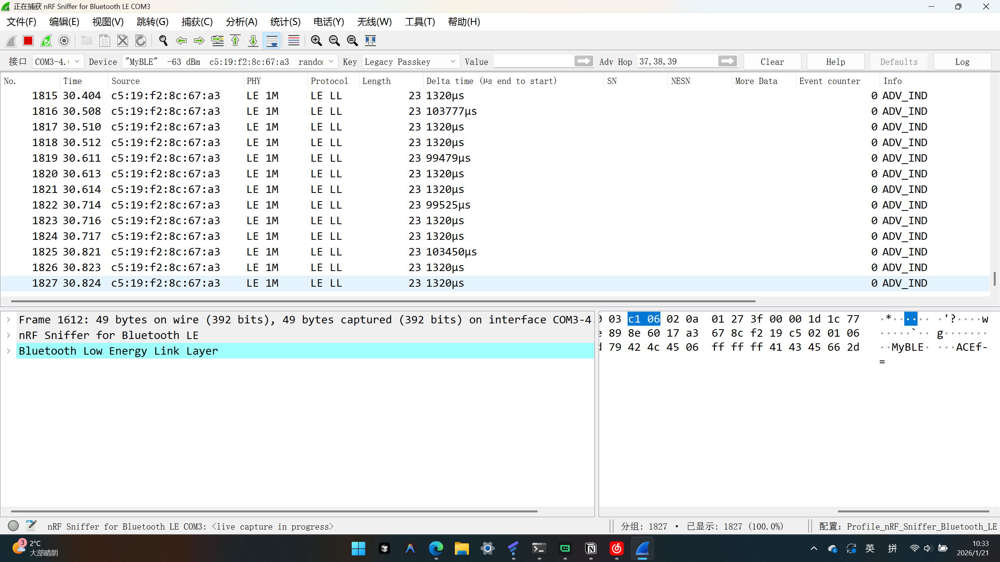

# Day 2: GAP 层广播 (Advertising) 与 抓包实战

> **摘要**：
> 本文记录了 nRF Connect SDK (NCS) 学习计划的第二天。目标是实现自定义 Manufacturer Data 广播，并使用 Wireshark + Sniffer 进行空中抓包验证。
> **特别章节**：详细记录了开发过程中遇到的 J-Link 锁死、环境路径丢失、序列号冲突以及 API 参数错误等“史诗级”坑点及解决方案。

---

## 🛠️ 第一部分：开启“上帝视角” (Sniffer 配置)

**硬件**：nRF52840 Dongle (出厂已预刷 Sniffer 固件)
**软件**：Wireshark + nRF Sniffer 组件

### 1.1 配置步骤

可以参考[这篇文章](https://blog.csdn.net/qq_26226375/article/details/136867630)
由于硬件已预刷固件，跳过刷写步骤，直接配置 PC 端环境：

1. **环境依赖**：确保电脑已安装 Python 3.x。
2. **下载组件**：从 Nordic 官网下载。
3. **安装 Python 依赖**：
   进入解压后的 `extcap` 目录，打开终端运行：

   ```bash
   pip install -r requirements.txt
   ```

   这一步如果怕python环境被污染，可以使用pyenv进行版本管理，并且在该文件下创建虚拟环境后执行

   ```bash
   pyenv local 3.x
   pip install -r requirements.txt
   ```

   或者使用poetry进行依赖管理

   ```bash
   pyenv local 3.x
   poetry init
   ```

   *一路回车最后都选择no即可。*

   ```powershell
   poetry env use python
   ```

   告诉 Poetry：“就用刚才 Pyenv 设定的那个 3.x”：
   *此时你会看到 Poetry 在当前目录下创建了一个 `.venv` 文件夹。*
   如果没有则先配置：

   ```powershell
   poetry config virtualenvs.in-project true
   ```

   *然后重复操作即可*

   *由于poetry不支持直接使用requirements.txt，需要手动安装依赖*
   打开 `requirements.txt` 可以看到

   ```
   pyserial>=3.5
   psutil
   ```

   手动安装依赖

   ```powershell
   poetry add "pyserial>=3.5" psutil
   ```

   最后需要编辑bat文件，换成适配虚拟环境的版本，将最后几行换成。

   ```bat
   where py > NUL 2>&1 
   if %ERRORLEVEL% EQU 0 (
       "C:\Program Files\Wireshark\extcap\.venv\Scripts\python.exe" "%NRF_SNIFFER_BLE_PATH%\nrf_sniffer_ble.py" %*
   ) else (
       "C:\Program Files\Wireshark\extcap\.venv\Scripts\python.exe" "%NRF_SNIFFER_BLE_PATH%\nrf_sniffer_ble.py" %*
   )
   ```
4. **植入 Wireshark**：

   * 打开 Wireshark -> `Help` -> `About Wireshark` -> `Folders` -> 打开 `Extcap path`。
   * 将下载包中 `extcap/` 文件夹下的**所有文件**复制到 Wireshark 的这个目录中。
5. **验证**：

   * 重启 Wireshark，按 `F5` 刷新。
   * 双击识别到的 **nRF Sniffer for Bluetooth LE** 接口即可开始抓包。

---

## 💻 第二部分：广播代码实战 (The Code)

**目标**：在广播包的 Manufacturer Data 字段中，广播出名字 "ACE" (Hex: `0x41 0x43 0x45`)。

### 2.1 关键配置 (`prj.conf`)

```ini
CONFIG_BT=y
CONFIG_BT_PERIPHERAL=y
CONFIG_BT_DEVICE_NAME="MyBLE"  # 设备名
CONFIG_BT_DEVICE_APPEARANCE=128 # 外观图标
```

### 2.2 核心逻辑 (`main.c`)

不需要列出全部代码，核心在于**如何构建数据包**以及**如何启动广播**。

#### **关键点 1：构建自定义数据包 (AD Structure)**

我们定义了一个 `bt_data` 数组，包含 Flags、完整名称和自定义厂商数据。

```c
static const struct bt_data ad[] = {
    // 1. Flags: 一般发现模式，不支持经典蓝牙
    BT_DATA_BYTES(BT_DATA_FLAGS, (BT_LE_AD_GENERAL | BT_LE_AD_NO_BREDR)),
  
    // 2. Name: 引用 Kconfig 中的名字 "MyBLE"
    BT_DATA(BT_DATA_NAME_COMPLETE, DEVICE_NAME, DEVICE_NAME_LEN),

    // 3. Manufacturer Data (重点): 
    // 格式: [Company ID Lo] [Company ID Hi] [Payload...]
    // 0xFFFF 为测试 ID，后面跟着 'A' 'C' 'E'
    BT_DATA_BYTES(BT_DATA_MANUFACTURER_DATA, 0xFF, 0xFF, 0x41, 0x43, 0x45),
};
```

#### **关键点 2：启动广播与 API 避坑**

这里有一个巨大的坑（Error -22）。

* **错误写法**：
  `bt_le_adv_start(BT_LE_ADV_CONN_NAME, ...)`
  *原因*：`BT_LE_ADV_CONN_NAME` 宏会自动把设备名加进广播包。但我已经在 `ad[]` 数组里手动加了名字，导致重复/冲突，报错 `-22` (Invalid Argument)。
* **正确写法**：

  ```c
  // 使用 BT_LE_ADV_CONN，仅表示“可连接”，不自动添加名字
  err = bt_le_adv_start(BT_LE_ADV_CONN, ad, ARRAY_SIZE(ad), sd, ARRAY_SIZE(sd));
  ```

---

## 💣 第三部分：

这一天，代码只写了 10 分钟，修环境修了 3 小时。以下是血泪经验总结。

### 🚧 坑点 1：环境路径丢失 (`west: command not found`)

* **现象**：在 VS Code 默认终端输入 `west` 提示找不到命令，输入 `nrfjprog` 提示找不到程序。
* **原因**：VS Code 默认 PowerShell 没有加载 NCS 的工具链环境变量。
* **解法**：
  * **方案 A (推荐)**：使用 **nRF Connect for Desktop -> Toolchain Manager -> Open Terminal**。这里的环境是绝对纯净且完整的。
  * **方案 B**：手动将 `nrf-command-line-tools/bin` 加入系统 PATH。

### 🚧 坑点 2：J-Link 变砖与 "Unknown Device"

* **现象**：`west flash` 报错，提示芯片 Unknown，或者 `Memory transfer fault`。
* **原因**：
  1. `west` 默认错误地调用了 `pyocd` 而非 `nrfjprog`，且 `pyocd` 无法解开 nRF52 的读保护。
  2. J-Link 接触不良或板子未上电（VTref 仅检测电压，不供电）。
* **解法**：
  1. **物理检查**：确保 VCC/GND/SWDIO/SWCLK 四线全通，板子独立供电。
  2. **强制解锁**：使用命令行复活芯片。
     ```bash
     nrfjprog --recover --family NRF52
     ```

### 🚧 坑点 3：Error -21 与手动复位大法

* **现象**：即便使用了 `--recover`，依然报错 `Error -21` (Unable to connect to debugger)。
* **原因**：芯片内部运行的旧代码（如 Day 1 的代码）导致上电即死锁，或者 J-Link 抢夺控制权失败。
* **绝招**：**手动复位强刷**。

  1. 输入命令但不回车：`nrfjprog --recover --family NRF52`
  2. 按住板子 RESET 键（或短接 RESET 到地）。
  3. 回车执行命令。
  4. 0.5秒后松开 RESET。

  * *结果：看见 `Erasing user code...` 即为胜利。*

### 🚧 坑点 4：序列号冲突 (Error 40)

* **现象**：VS Code 记住了旧的 J-Link 序列号（123456），而实际设备是另一个（20090928），导致无法烧录。
* **解法**：绕过 IDE，使用命令行降维打击。
  ```bash
  # 强制指定序列号或直接由 nrfjprog 自动识别
  nrfjprog --program build/zephyr/zephyr.hex --chiperase --verify -f NRF52
  ```

---

## ✅ 第四部分：验收 (Verification)

历经磨难，终见彩虹。

### 4.1 手机端 (nRF Connect APP)

扫描到设备名为 **"MyBLE"**。
点击 Raw Data，看到 Manufacturer Data 为：
`0xFF 0xFF 0x41 0x43 0x45` -> **ACE**。

### 4.2 抓包端 (Wireshark)

成功抓取到 **ADV_IND** 包，数据解析如下：

* **Length**: `06`
* **Type**: `0xFF` (Manufacturer Specific Data)
* **Company ID**: `FFFF`
* **Data**: `41 43 45` (ACE)

---

## 📝 总结

Day 2 的教训比代码更有价值：

1. **不要过度依赖 IDE**：当 VS Code 报错时，底层的命令行 (`nrfjprog`) 才是最诚实的工具。
2. **物理连接是基础**：软件再对，线松了也是白搭。
3. **工程化思维**：遇到冲突（如 API 参数错误），回归文档查找宏定义的含义。

**Next Step**: Day 3 - Connection & GATT Services.
