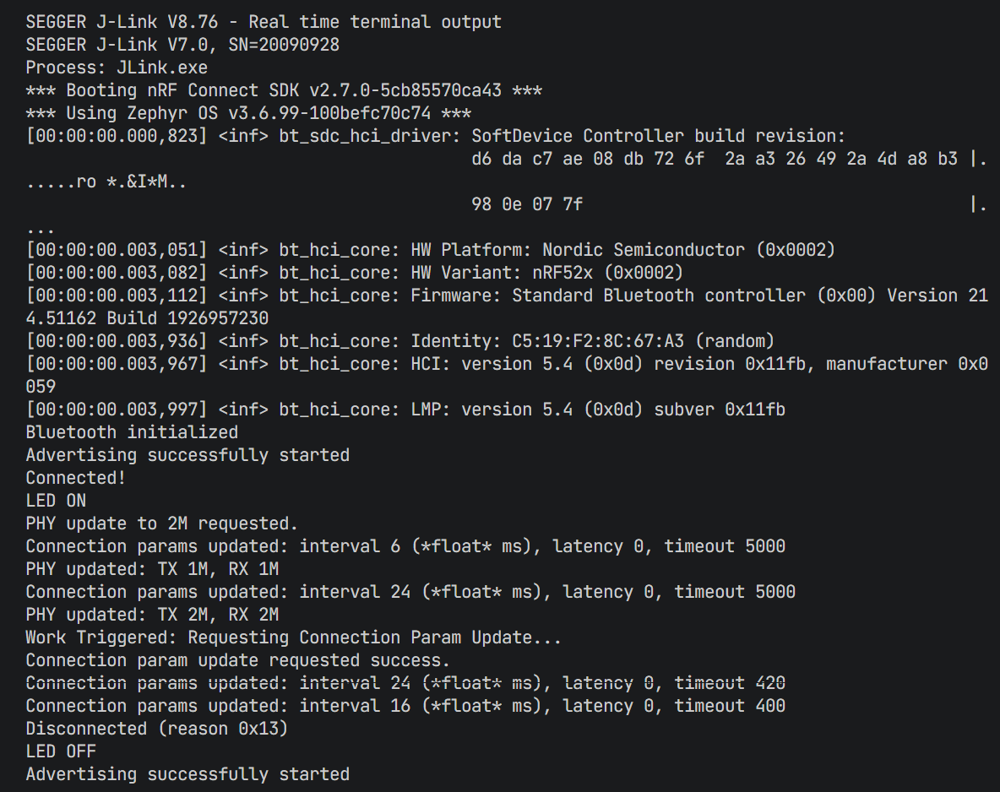

# Day 3: Link Layer Control —— 连接参数与 PHY 状态机

## 1. 目标概述 (Objective)

在完成了基础的广播 (Day 2) 后，Day 3 的核心任务是深入 **链路层 (Link Layer)** 的控制。我们需要让设备不仅仅是“连上”，而是能根据应用需求调整连接的**速度**（PHY）和**节奏**（Connection Parameters）。

**核心成果：**

* **硬件适配**：通过 Device Tree Overlay 适配非官方核心板。
* **状态感知**：利用回调函数 (`callbacks`) 精确感知连接与断开。
* **高速模式**：将物理层速率从 1Mbps 切换至 2Mbps (Bluetooth 5.0 Feature)。
* **功耗平衡**：在连接稳定后，主动请求修改连接间隔 (Connection Interval)。

---

## 2. 硬件描述文件 (Device Tree Overlay)

由于使用的是非官方 DK (nRF52832 Core Board)，我们需要告诉 Zephyr 我们的 LED 接在哪里。

**文件：`xx.overlay(与Day1一致)`**

```dts
/ {
    /* 定义 LED 节点 */
    my_leds {
        compatible = "gpio-leds";
        /* 对应 P0.02，高电平有效 */
        led_custom_1: led_1 {
            gpios = <&gpio0 2 GPIO_ACTIVE_HIGH>;
        };
    };

    /* 映射别名，以便 C 代码可以通过 DT_ALIAS(led0) 找到它 */
    aliases {
        led0 = &led_custom_1;
    };
};
```

* **为什么要写这个？** Zephyr 的驱动是与硬件解耦的。代码中只调用 "led0"，而 "led0" 到底对应哪个引脚，由 `.dts` (设备树) 决定。这体现了**硬件抽象层**的优势。

---

## 3. 工程配置 (Kconfig)

**文件：`prj.conf`**

```properties
# 1. 基础配置
CONFIG_BT=y
CONFIG_BT_PERIPHERAL=y  # 设为外设角色，自动开启连接功能

# 2. PHY 更新支持 (关键)
CONFIG_BT_PHY_UPDATE=y      # 开启 PHY 更新功能
CONFIG_BT_USER_PHY_UPDATE=y # 允许应用层(User)主动发起 PHY 更新请求

# 3. 调试支持
CONFIG_LOG=y
CONFIG_USE_SEGGER_RTT=y     # 使用 J-Link RTT 查看日志，不占用 UART
```

* **注意**：在 SDK v2.7.0 中，`CONFIG_BT_CONN_PARAM_UPDATE` 已弃用。只要是 Peripheral 角色，默认即支持参数更新请求。

---

## 4. 核心代码解析 (Main.c)

### 4.1. 连接回调结构体 (`bt_conn_cb`)

这是 BLE 事件驱动开发的核心。

```c
/* 定义回调函数 */
BT_CONN_CB_DEFINE(conn_callbacks) = {
    .connected = connected,           // 连上时调用
    .disconnected = disconnected,     // 断开时调用
    .le_param_updated = le_param_updated, // 参数(Interval/Latency)变化时调用
    .le_phy_updated = le_phy_updated,     // PHY(1M/2M)变化时调用
};
```

* **原理**：`BT_CONN_CB_DEFINE` 是一个宏，它利用链接器脚本将你的结构体注册到协议栈的内部列表中。
* **作用**：你不需要在主循环里轮询“有没有连上？”，协议栈会在事件发生时直接“通知”你。

### 4.2. 连接建立与上下文管理

```c
static void connected(struct bt_conn *conn, uint8_t err)
{
    // ... 错误检查 ...
  
    // 关键步骤：增加引用计数
    current_conn = bt_conn_ref(conn);
  
    // 业务逻辑：点灯、请求 PHY 更新、开启延时任务
}
```

* **为什么要 `bt_conn_ref`？**
  * `conn` 指针由协议栈管理。如果不增加引用计数 (`ref`)，一旦连接断开或出现异常，协议栈可能会释放这块内存。如果我们后续还在操作这个指针，就会导致 **UAF (Use-After-Free)** 崩溃。
  * 对应地，在 `disconnected` 中必须调用 `bt_conn_unref`。

### 4.3. PHY 更新 (2M High Speed)

```c
/* SDK v2.7.0 新 API 写法 */
const struct bt_conn_le_phy_param param = {
    .options = BT_CONN_LE_PHY_OPT_NONE,
    .pref_tx_phy = BT_GAP_LE_PHY_2M, // 希望发送用 2M
    .pref_rx_phy = BT_GAP_LE_PHY_2M, // 希望接收用 2M
};
bt_conn_le_phy_update(conn, &param);
```

* **作用**：将传输速率翻倍。
* **工程意义**：
  1. **吞吐量**：从 ~700kbps 提升至 ~1300kbps。
  2. **功耗**：发送同样大小的数据包，空口占用时间减半，射频开启时间减半 = **省电**。

### 4.4. 连接参数更新 (Connection Parameter Update)

我们希望连接稳定后，将间隔设定为 **20ms**。

```c
/* 定义参数: Min 20ms, Max 20ms, Latency 0, Timeout 400ms */
/* 计算公式: 16 * 1.25ms = 20ms */
static struct bt_le_conn_param *my_conn_params = BT_LE_CONN_PARAM(16, 16, 0, 40);

/* 在延时工作项中调用 */
bt_conn_le_param_update(current_conn, my_conn_params);
```

* **为什么要延时 5 秒？**

  * 刚连接时，手机（Central）需要快速交互来发现服务（Service Discovery）。如果此时间隔太大（例如 500ms），服务发现会非常慢，导致用户体验卡顿。
  * **最佳实践**：连接初期使用小间隔（快速），数据交互稳定后切换大间隔（省电）或特定间隔（如音频/高吞吐）。
* **参数详解**：

  * **Interval (1.25ms 单位)**：两次通信之间的时间差。
  * **Latency**：允许 Slave 跳过多少次心跳（省电用，但会增加延迟）。
  * **Timeout (10ms 单位)**：超过这个时间没收到包，视为断连。

### 4.5.编译和烧录 (Build & Flash)

* **编译**：可以直接使用VScode的build按钮，也可以在Day3代码文件下的命令行（通过nRF插件启动的命令行）中使用 `west build --board nrf52dk/nrf52832` 编译。
* **烧录**：由于Day2的时候发现了Jlink的识别问题，无法使用VScode的烧录功能，也就是无法在命令行中使用 `west flash` 命令将程序烧录到开发板。
  需要在Day3代码文件下的命令行中使用 `nrfjprog --program build/zephyr/zephyr.hex --chiperase --verify -f NRF52` 命令将程序烧录到开发板。

---

## 5. 抓包与日志验证 (Verification)

### 5.1. RTT 日志流

```text
Connected!                  <-- 连接建立
LED ON                      <-- 状态指示
PHY update to 2M requested. <-- 立即发起 PHY 请求
PHY updated: TX 2M, RX 2M   <-- 协商成功，进入高速模式
... (5秒后) ...
Work Triggered...           <-- 延时任务触发
Connection params updated: interval 16 ... <-- 协商成功，Interval 变为 20ms
```



### 5.2. Wireshark 关键帧

在 Wireshark 过滤器输入 `btle.data_header.llid == 0x03` (查看 LL 控制包) 可以清晰看到以下流程：

1. **`LL_PHY_REQ` / `LL_PHY_RSP`**：双方交换支持的 PHY 能力，最后敲定 2M。
2. **`LL_CONNECTION_UPDATE_IND`**：这是最关键的一帧。由 Master (手机) 发出，指示 Slave (板子)：“在未来的某个时间点，我们将把 Interval 改为 16 (20ms)”。

---

## 6. 学习总结

Day 3 完成了从“广播者”到“连接者”的蜕变。我们不再是被动地发包，而是建立了双向的链路，并学会了如何控制这条链路的**质量**（PHY）和**特性**（Params）。

**下阶段预告 (Day 4)**：
既然路修好了（连接建立），车也提速了（2M PHY），交通规则也定好了（Interval），接下来就要开始**运货**了——学习 **GATT 服务、Characteristic 与数据传输**。
